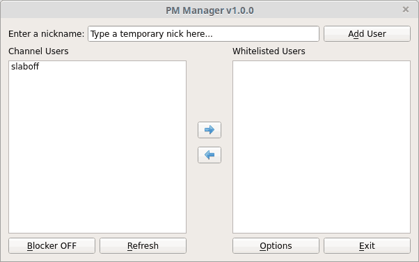
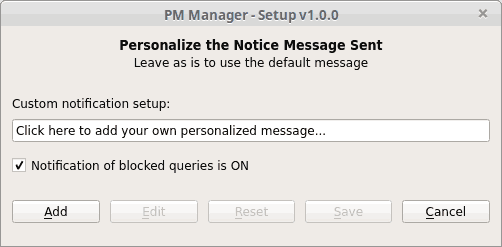

### Introduction

Welcome, to the PM Manager Addon.

The PM Manager is user manageable global private message blocker for KVIrc 4.9.2.
It features simple but comprehensive dialogs and context menu entries designed to easily allow the whitelisting of users temporarily or permanently.

The PM Manager features a in active window notification system, that also shows you and the blocked user of any filtered PM by default.
It features a the pre-configured default message the blocked user sees and allows you to configure your
own personalized notification message.

The PM Manager allows you to easily keep a single working and refreshable backup and allows you to restore information in those backups making it available immediately for you to manage.

### Features

* In channel context menu entries that control the PM Manager and the enables and disables the PM blocker function.
* On user context menu entries that allow adding, removing, replacing or changing the target user from a temporary to/or permanent whitelist.
* A dialog with list display control and access buttons.
  * Refreshable Channel Users and Whitelisted Users lists.
  * Enable/Disable notification of blocked messages.
  * Comprehensive tooltips in all controls that show hints of what controls do.
* A static Backup and Restore functionality for permanent whitelist and main PM Manager configuration saving.
* Comprehensive in active window feedback messaging, serving as visual confirmations.
* Comprehensive support for keyboard access via Alt+"Key"
* A comprehensive help file.

### Todo

* Add screenshots of context menu options to help file.
* Bump version to beta at some stage?
* More testing
* Make PR to upstream.

### Install

#### From Source

Once you have the files extracted.
* Via the scripting Menu Entry and select `Execute Script`
* Or via ```Ctrl+Shift+X```
* Navigate to location you extracted the addon
  then select the ```install.kvs``` file and click open.

#### From Binary
*  and extract it.
* Goto Settings menu or press ```Ctrl+Shft+N```
* Scroll to Use the `Manage Addons`
* Click the Open Box Icon (Install addon package from disk) and Browse for the extracted ```PM_Manager_$version.kva```

##### SHA256 Hash
```hash
155D63C7D1763AB2957734490BED7AC39DAD1AC0F7E2B3A8E6B85CAA67187014
```

You should see the following lines (no matter the install method used):
```
Attempting to register addon "PM Manager" with version 1.0.0
Addon successfully registered
Notice: PM Manager Addon Version - 1.0.0  Initialization Complete.
```

### Uninstall

* Goto Settings menu
* Scroll to Use the `Manage Addons` or ```Ctrl+Shft+N```
* Select the addon and click the Bin Icon (Delete selected addon) to remove the PM Manager

>#### Note: When uninstalling and if you made a backup during usage, you will be asked if you wish to remove this backup. If you are planning to re-install the addon at a later time, click **NO**.

You should see the following message:
```
Notice: PM Manager Addon v1.0.0 has been successfully removed.
```

### Screenshots

##### PM Manager -  Main Dialog



##### PM Manager - Options Setup Dialog



### Usage

See the PM Manager's help file [here](http://htmlpreview.github.io/?https://github.com/the-j0k3r/kvirc-scripts/blob/pm-manager/pm-manager/help/pmm-help.html)

### License

[](LICENCE)
