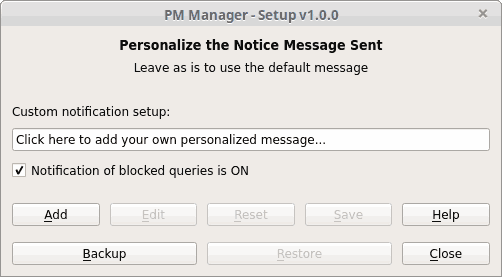

### Introduction

Welcome this is an alpha package for the PM Manager Addon.

The PM Manager is a user manageable global private message blocker for KVIrc.
The PM Manager has a simple UI to whitelist users temporarily or permanently, or
via a simple context menu entry.

The PM Manager notifies you and blocked users of any blocked PMs by default and
allows you in addition to the pre-configured default message, to configure your
own personalized notification message to send to users instead.

### Todo

* Add screenshots of context menu options to help file.
* Bump version to beta at some stage?

### Install

#### From Source

Once you have the files extracted.
* Via the scripting Menu Entry and select `Execute Script`
* Or via ```Ctrl+Shift+X```
* Navigate to location you extracted the addon
  then select the ```install.kvs`` file and click open.

#### From Binary
*  and extract it.
* Goto Settings menu or press ```Ctrl+Shft+N```
* Scroll to Use the `Manage Addons`
* Click the Open Box Icon (Install addon package from disk) and Browse for the extracted ```PM_Manager_$version.kva```

You should see the following lines (no matter the install method used):
```
Attempting to register addon "PM Manager" with version 1.0.0
Addon successfully registered
Notice: PM Manager Addon Version - 1.0.0  Initialization Complete.
```

### Uninstall

* Goto Settings menu
* Scroll to Use the `Manage Addons` or ```Ctrl+Shft+N```
* Select the addon and click the Bin Icon (Delete selected addon) to remove the PM Manager.

You should see the following message:
```
Notice: PM Manager Addon v1.0.0 has been successfully removed.
```

### Screenshots

##### PM Manager -  Main Dialog


##### PM Manager - Options Setup Dialog


### Usage

See 

### License

[](LICENCE)
